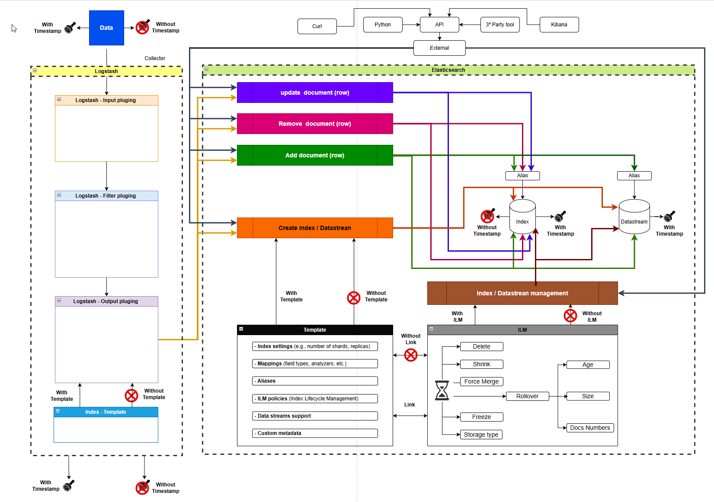

# My-intro-Elastic
Elasticsearch training 

# Requirements:
OS:
- OS : Windows 11
- PC with 16 Gb RAM
- WSL Ubuntu
- Docker in WSL - install
- Docker compose - install

Vscode:
- extentions:
    - [Dev Container](https://marketplace.visualstudio.com/items?itemName=cweijan.vscode-database-client2)
    - [Docker compose](https://marketplace.visualstudio.com/items?itemName=p1c2u.docker-compose)
    - [Elasticsearch Developer tools](https://marketplace.visualstudio.com/items?itemName=crasnam.elasticdeveloper)
    - [Database client](https://marketplace.visualstudio.com/items?itemName=cweijan.vscode-database-client2)
    - [Peacock](https://marketplace.visualstudio.com/items?itemName=johnpapa.vscode-peacock)

# During 
- 6 to 7 Hours

## 01 - What is Elasticsearch?

- How to run a Elasticseatch docker image - One node.
- How to config some parameters in Elasticsearch.
- Tools to interact with Elasticsearch.
    - Kibana
    - Cerebro 
    - ElasticVue

## 02 - Function diagram of data flux as logs

- Source
- Collector
- Transport
- parsing
- storage
- visualization

## 03 - How to write into Elasticsearch

Overall diagram.

## 04 - Unstructure and structure log

## 05 - Possible way to write to Elasticsearch

- Timestamp
- Template Logstash
- Template Elasticsearch
- Ilm
- Rollover

## 06 - Possible way to write to Elasticsearch - basic - only index

- Api - create a create index and add documents.
- Logstash - simple
    - Timestamp ( with and without).
    - Template Logstash ( with and without).
    - Template Elasticsearch ( with and without).

## 07 - Possible way to write to Elasticsearch - index versus datasteam 

- Logstash basic example

## 08 - Possible way to write to Elasticsearch - index and datasteam 

- Logstash example
    - Ilm ( with and without).
    - Rollover ( with and without).

## 09 - Mapping

## 10 - Field text versus keyword

## 11 - What is a cluster

## 12 - shards

## 13 - Unstructure and structure log

## 14 - logstash 

## 15 - Kibana

## 16 - Licences

## 17 - Best pratices

06
David Frazao
