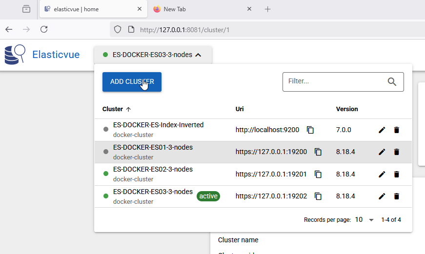

# URL-ES
http://127.0.0.1:8081

# In same cases when you logon for the first time
# you need to click to link "https//:127.0.0.1:19200"
# to accept the https risk and login (user + pass)
# and only then Elasticvue is able to access the 
# elasticsearch node 

!