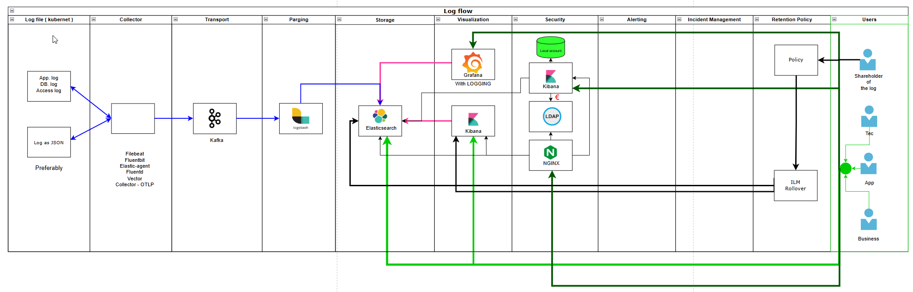

[Back to README](../README.md)

# Diagram: Log flow

Here’s a concise **observability stack overview** summarizing each core component and its role:

---

### 🔹 **1. Source**

Where telemetry data originates — the systems being observed.
**Examples:**

* Applications (via OpenTelemetry SDKs/instrumentation)
* System metrics (Node Exporter, cAdvisor)
* Logs (Fluent Bit, Filebeat, Loki clients)
* Traces (Jaeger/Tempo instrumentation)

---

### 🔹 **2. Collector**

Agents or services that gather, process, and forward telemetry data.
**Examples:**

* **Grafana Alloy** / **OpenTelemetry Collector** (metrics, logs, traces)
* **Prometheus** (scrapes metrics directly)
* **Fluent Bit / Logstash** (for logs)

---

### 🔹 **3. Transport**

Mechanism and protocol used to move telemetry between components.
**Examples:**

* **OTLP (OpenTelemetry Protocol)**
* **HTTP / gRPC**
* **Kafka / NATS / MQTT** (streaming transport)
* **Prometheus Remote Write**

---

### 🔹 **4. Visualization**

Dashboards and tools to explore, analyze, and visualize telemetry.
**Examples:**

* **Grafana** (unified metrics/logs/traces)
* **Kibana** (Elastic Stack visualization)
* **Jaeger / Tempo UI** (trace visualization)

---

### 🔹 **5. Parsing**

Transforms raw telemetry into structured, usable data.
**Examples:**

* **Logstash / Fluent Bit parsers**
* **OTel Collector processors**
* **Regex / JSON / Grok parsers**

---

### 🔹 **6. Storage**

Databases or backends that persist telemetry data.
**Examples:**

* **Mimir / Prometheus** → metrics
* **Loki / Elasticsearch** → logs
* **Tempo / Jaeger / ClickHouse** → traces
* **Pyroscope / Parca** → profiles

---

### 🔹 **7. Security**

Protects observability data in transit and at rest, and ensures proper access.
**Practices:**

* TLS encryption (mTLS between agents and backends)
* Authentication (OIDC, API keys, Basic Auth)
* Authorization (RBAC, group-based access)
* Data sanitization and least privilege

---

### 🔹 **8. Alerting**

Monitors telemetry for anomalies and triggers notifications.
**Examples:**

* **Alertmanager** (Prometheus ecosystem)
* **Grafana Alerting**
* **ElastAlert / Kibana Alerts**

---

### 🔹 **9. Incident Management**

Tools and processes for responding to alerts and diagnosing issues.
**Examples:**

* **PagerDuty / Opsgenie / VictorOps**
* **Grafana OnCall**
* **Jira / ServiceNow integrations**
* **Runbooks & Postmortems**

---

### 🔹 **10. Retention Policy**

Defines how long data is stored and how it’s rolled off.
**Examples:**

* **Prometheus / Mimir retention:** time-based (e.g., 30d)
* **Loki / Elasticsearch ILM:** tiered storage & deletion
* **Tempo:** retention per trace duration
* **Policy goal:** balance cost vs observability depth

---

Would you like me to **map this to a concrete stack** (e.g., Grafana + OpenTelemetry + Loki + Mimir + Tempo + Alloy) to show how each layer is implemented in practice?

