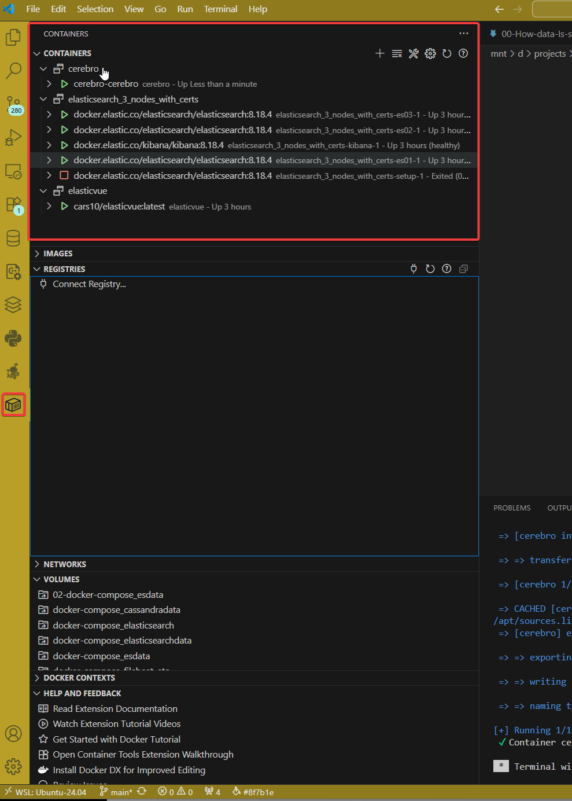

---
tags:
  - inverted-index
---
# 

## ⚒️ Resources

- Docker-compose: 
	- Elasticsearch instance 
	- Lukas application to read a invert index in Elasticsearch 
	- Kibana

## 🎯Goal of the exercise

Ingest data in Elasticsearch and verify how the data in managed by inverted index.

## 📚Theory 

[[How does Elasticsearch store and query logs.excalidraw]]

[[01-How-Elasticsearch-store-the-data]]

## 🏋️‍♂️Exercise

### 1 - start docker-compose 

On the Vscode, select the docker-compose.yml file on click on the right of your mouse button and select "Compose up", then wait until the docker images are running.

How to check that the docker a running as expected, simple Vscode extention named "Container" and see in the docker images states.

