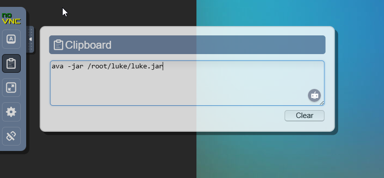
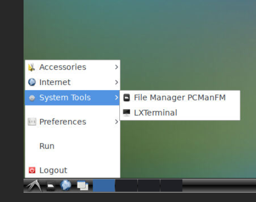
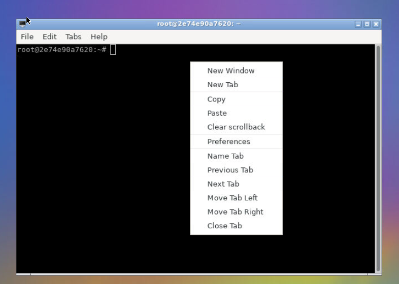
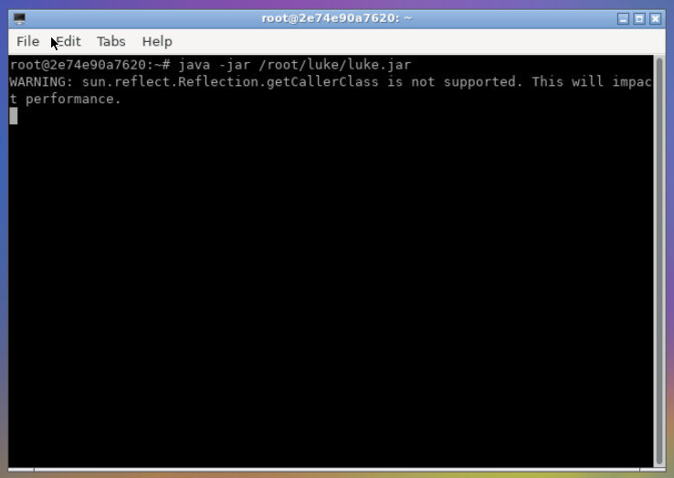
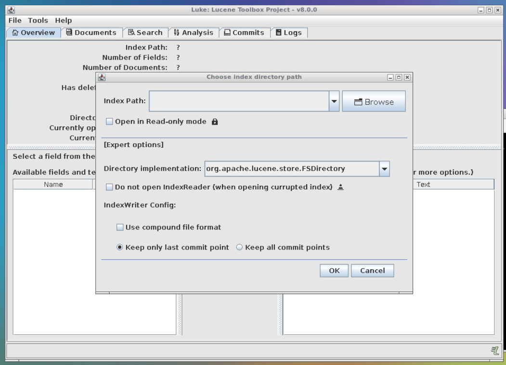
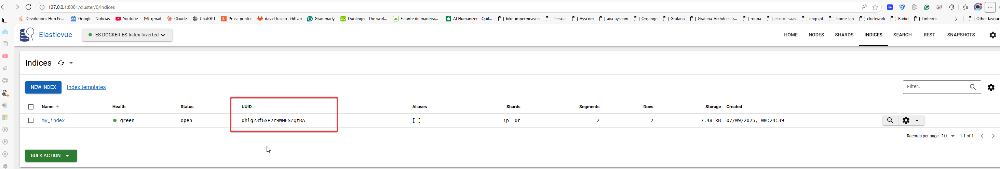
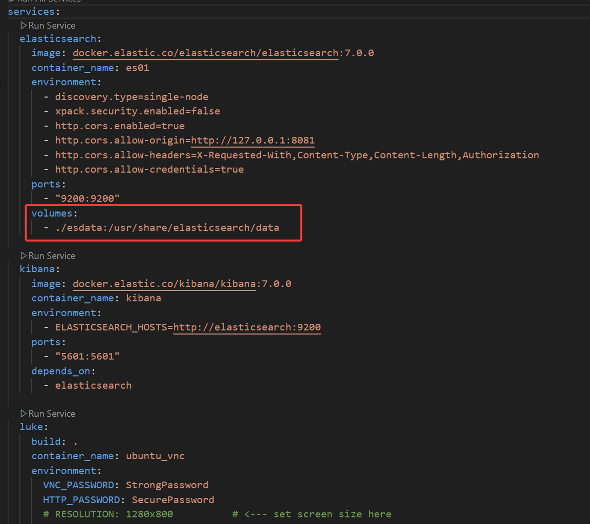
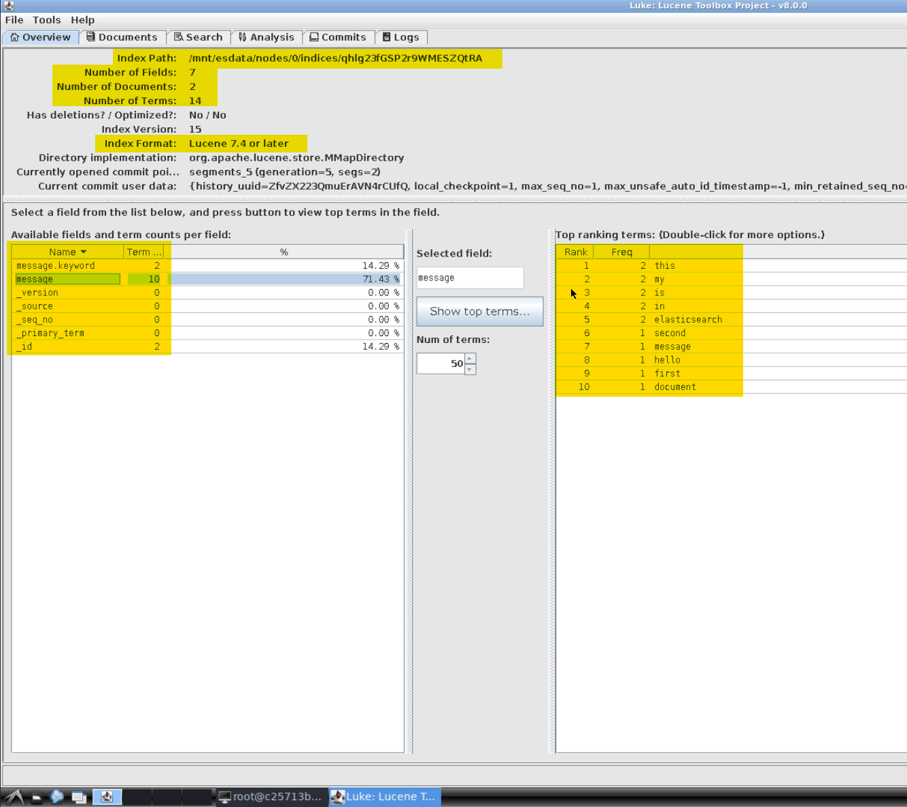

---
tags:
  - inverted-index
---
# 

## ⚒️ Resources

- Docker-compose: 
	- Elasticsearch instance 
	- Lukas application to read a invert index in Elasticsearch ( Only with version 7 of Elasticsaerch)
	- Kibana
	- vnc
## links 
# Elasticsearch
http://127.0.0.1:9200
# Kibana
http://127.0.0.1:5601
## luke 
http://127.0.0.1:6080

http://127.0.0.1:5900

## 🎯Goal of the exercise

Ingest data in Elasticsearch and verify how the data in managed by inverted index.

## 📚Theory 

[[How does Elasticsearch store and query logs.excalidraw]]

[[01-How-Elasticsearch-store-the-data]]


## 🏋️‍♂️Exercise

### 1 - start docker-compose 

On the Vscode, select the docker-compose.yml file on click on the right of your mouse button and select "Compose up", then wait until the docker images are running.

How to check that the docker a running as expected, simple Vscode extention named "Container" and see in the docker images states.


### 2 - access vnc on web browser

Link 
[access vnc with lukas application](Http://127.0.0.1:6080)

if the browser request user and password: 

- user: root 
- password: SecurePassword

next request on the password:

- password: StrongPassword

you need to pass the command line to execute the lukas application, due to the web broswer interface you need to copy the command: 

```
java -jar /root/luke/luke.jar
```
 on the vnc clipboard.




next open the terminal 




paste the command line




and execute ( wait for the application to open)




application is up




### 3 Elasticsearch 

Resources

[access Kibana](Http://127.0.0.1:5601)

[access Kibana - consola](http://127.0.0.1:5601/app/kibana#/dev_tools/console?_g=())


Create in index within Kibana:

```
PUT my_index
{
  "settings": {
    "number_of_shards": 1,
    "number_of_replicas": 0
  }
}
```
you can se the index with [Elasticvue](http://127.0.0.1:8081) - ES-DOCKER-ES-Index-Inverted

Add document to the index 

```
POST my_index/_doc
{
  "message": "Hello, this is my first document in Elasticsearch!"
}
```

```
POST my_index/_doc
{
  "message": "This is my second message in Elasticsearch!"
}

```
to interact with the lukas application tools you need to the uuid of the index



and the storage path used by Elasticsearh to quit the indexes data.




data path: 

```
/mnt/esdata/nodes/0/indices/<UUID-INDEX>
/mnt/esdata/nodes/0/indices/qhlg23fGSP2r9WMESZQtRA
```

the inverted index in the lukas application 




you can also see section: 

- documents 
- Analysis

